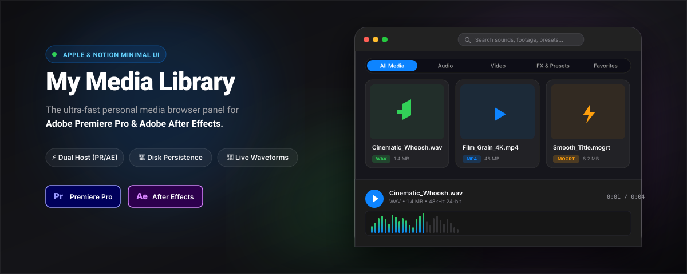
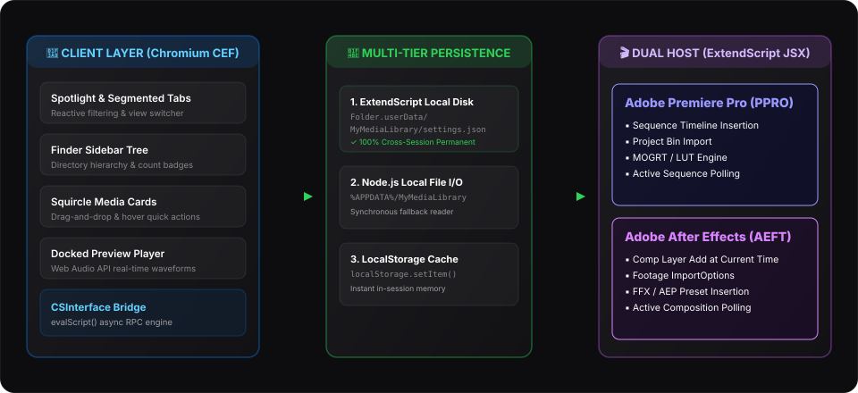

<p align="center">
  
</p>

<p align="center">
  <strong>The ultra-fast personal media browser panel for Adobe Premiere Pro & Adobe After Effects.</strong><br>
  Built with an Apple & Notion minimal motion design system, real-time audio waveforms, instant search, and permanent multi-tier disk memorization.
</p>

<p align="center">
  
  
  
  
  
  
</p>

---

## 🌟 Overview

**My Media Library** is a lightweight, responsive Adobe CEP panel designed for video editors and motion designers who need instant access to their sound effects, music, footage, overlays, MOGRTs, LUTs, and presets without ever leaving their timeline.

### Why My Media Library?
- 🎬 **Dual-Host Support**: Works identically inside **Adobe Premiere Pro** and **Adobe After Effects**.
- 🍏 **Apple & Notion Minimal UI**: Clean dark glassmorphism, responsive squircle cards, Spotlight search pill, and segmented control tabs.
- 💾 **Permanent Memorization**: Multi-tier disk persistence ensures your watch folders, favorites, and settings are never lost after closing Premiere Pro or After Effects.
- 🎵 **Live Web Audio Waveforms**: Instant hover preview and dock player with interactive click-to-seek audio waveforms.
- 🎯 **One-Click Timeline / Comp Insertion**: Drop assets straight to your playhead or composition time.
- 📁 **Finder-Style Tree Hierarchy**: Deep multi-level subfolder scanning with item count badges.

---

## 🏗️ Architecture & Design Structure

<p align="center">
  
</p>

### Design System Specification

| Element | Apple / Notion Design Token | Description |
|---|---|---|
| **Base Canvas** | `#0a0a0c` | Deep void black background |
| **Glass Surface** | `rgba(24, 24, 28, 0.75)` | Translucent backdrop blur (`24px`) |
| **Accent Primary** | `#0a84ff` (Apple System Blue) | Interactive pills, playheads, and selections |
| **Audio Accent** | `#30d158` (Apple Emerald Green) | Sound cards, waveform visualizers, active sequence indicator |
| **Video Accent** | `#0a84ff` (Apple Sky Blue) | Video clips and media overlays |
| **FX / Preset Accent** | `#ff9f0a` (Apple Amber) | MOGRTs, LUTs, FFX, and presets |
| **Typography** | `SF Pro Display`, `-apple-system`, `Inter` | Monospace numbers for timecodes |
| **Border Radii** | `8px` (cards), `12px` (modals), `9999px` (pills) | Refined squircle curvatures |

---

## ✨ Feature Breakdown

### 1. Dual-Host Timeline & Comp Insertion
- **Premiere Pro (`PPRO`)**: Inserts audio/video clips directly at the active sequence playhead (`seq.setPlayerPosition` / `track.insertClip`). Double-click MOGRTs to add them directly to the timeline.
- **After Effects (`AEFT`)**: Imports footage through `ImportOptions` and adds layers directly to the active `CompItem` at `comp.time`.
- **Live Host Polling**: The footer status bar dynamically displays your active Sequence or Composition name with a pulsating green status dot.

### 2. Multi-Tier Permanent Storage (Zero Session Loss)
Adobe CEP instances frequently wipe or isolate browser `localStorage` across host applications. My Media Library uses a robust 3-tier persistence strategy:
1. **ExtendScript Local Disk Storage**: Writes JSON configuration to `Folder.userData/MyMediaLibrary/settings.json`.
2. **Node.js Local File Storage**: Reads/writes directly to `%APPDATA%/MyMediaLibrary/settings.json`.
3. **Browser Cache Synchronization**: Real-time sync with `localStorage`.

### 3. Apple Music-Style Docked Preview Player
- **Interactive Waveform Visualizer**: Powered by the Web Audio API (`AnalyserNode`), rendering real-time 60fps frequency bars with an Apple gradient.
- **Click-to-Seek**: Click anywhere on the waveform canvas or progress scrubber to jump to that timestamp instantly.
- **Hover Play**: Hover over any audio card to audition sounds immediately.

### 4. Finder Tree & Spotlight Search
- **Spotlight Search Pill**: Instant reactive filtering across your entire library as you type.
- **Folder Tree Hierarchy**: Expand and collapse directory branches with item count badges.
- **Segmented Control Tabs**: Quickly switch between `All`, `Audio`, `Video`, `FX & Presets`, and `Favorites`.

---

## 📂 Supported File Formats

| Category | File Types & Extensions | Capabilities |
|---|---|---|
| **🎵 Audio** | `.mp3`, `.wav`, `.aac`, `.m4a`, `.ogg`, `.flac`, `.aiff`, `.aif`, `.wma`, `.opus` | Live waveform, hover playback, timeline/comp insert |
| **🎬 Video & Graphics** | `.mp4`, `.mov`, `.avi`, `.mkv`, `.wmv`, `.webm`, `.m4v`, `.png`, `.jpg`, `.jpeg`, `.gif`, `.svg`, `.psd`, `.ai` | In-panel video player, scrub bar, timeline/comp insert |
| **✨ Motion Templates** | `.mogrt` | Direct timeline insertion, project import |
| **🎨 Color LUTs** | `.cube`, `.3dl`, `.look`, `.mga` | One-click project bin import, explorer reveal |
| **⚡ Effect Presets** | `.epr`, `.prfpset` (Premiere), `.ffx` (After Effects) | Reveal in explorer, project import |
| **📦 Projects** | `.prproj`, `.aep` | Project import, explorer reveal |

---

## 🚀 Installation Guide

### Option A: Automatic Installation (Windows)

1. Download the latest **[`MyMediaLibrary-v1.0.0.zip`](release/MyMediaLibrary-v1.0.0.zip)** from the [Releases](../../releases) tab.
2. Extract the archive into your CEP extensions directory:
   ```
   %APPDATA%\Adobe\CEP\extensions\com.mylibrary.mediabrowser\
   ```
3. Right-click **`install.bat`** (or `install.ps1`) and select **Run as Administrator**.
   - This sets `PlayerDebugMode=1` so Adobe applications load the extension.
4. Launch **Adobe Premiere Pro** or **Adobe After Effects** and open:
   ```
   Window > Extensions > My Media Library
   ```

---

### Option B: Manual Installation (Windows & macOS)

#### 1. Copy Files to Extension Folder

- **Windows**:
  ```powershell
  %APPDATA%\Adobe\CEP\extensions\com.mylibrary.mediabrowser\
  ```
- **macOS**:
  ```bash
  ~/Library/Application Support/Adobe/CEP/extensions/com.mylibrary.mediabrowser/
  ```

#### 2. Enable Adobe CEP PlayerDebugMode

- **Windows** (PowerShell):
  ```powershell
  4..20 | ForEach-Object {
      Set-ItemProperty -Path "HKCU:\Software\Adobe\CSXS.$_" -Name "PlayerDebugMode" -Value "1" -Force
  }
  ```
- **macOS** (Terminal):
  ```bash
  defaults write com.adobe.CSXS.11 PlayerDebugMode 1
  defaults write com.adobe.CSXS.12 PlayerDebugMode 1
  defaults write com.adobe.CSXS.13 PlayerDebugMode 1
  defaults write com.adobe.CSXS.14 PlayerDebugMode 1
  ```

#### 3. Open Extension
Launch Premiere Pro or After Effects and open **Window > Extensions > My Media Library**.

---

## ⌨️ Keyboard Shortcuts & Controls

| Shortcut / Action | Function |
|---|---|
| `Space` | Play / Pause active preview |
| `→` (Right Arrow) | Jump forward 5 seconds |
| `←` (Left Arrow) | Jump backward 5 seconds |
| `↑` / `↓` | Volume Up / Down |
| `Double Click Card` | Insert media directly into Timeline / Active Comp |
| `Drag & Drop` | Drag media card directly into Premiere / AE sequence |
| `Right Click Card` | Open context menu (Preview, Timeline, Project, Favorite, Reveal) |
| `Right Click Folder` | Open directory context menu (Reveal in Explorer / Remove) |
| `Esc` | Close context menu or folder manager modal |

---

## 📁 Repository Structure

```
My-Media-Library/
├── assets/
│   ├── banner.svg            # Hero banner illustration
│   ├── logo.svg              # Squircle icon logo
│   └── architecture.svg      # Technical architecture diagram
├── CSXS/
│   └── manifest.xml          # Extension declaration (PPRO & AEFT dual host)
├── client/
│   ├── index.html            # Apple/Notion minimal HTML layout
│   ├── css/
│   │   └── styles.css        # Glassmorphism & Apple design system stylesheet
│   └── js/
│       ├── CSInterface.js    # Adobe CEP SDK bridge
│       ├── app.js            # Main controller, multi-tier storage, folder tree
│       ├── fileScanner.js    # Multi-format detection and classification
│       └── previewPlayer.js  # Web Audio API waveform player & video scrubber
├── host/
│   └── index.jsx             # ExtendScript host engine for Premiere Pro & AE
├── release/
│   ├── MyMediaLibrary-v1.0.0.zip   # Ready-to-use distribution package
│   └── com.mylibrary.mediabrowser.zxp
├── .debug                    # CEP remote debug configuration (ports 8088, 8089)
├── .gitignore                # Git ignore patterns
├── deploy.ps1                # Sync script to active CEP folders
├── install.bat               # Windows batch installer
├── install.ps1               # PowerShell installer & debug mode enabler
├── package-release.ps1       # Automated release packager script
├── LICENSE                   # MIT License
└── README.md                 # Complete documentation
```

---

## 🛠️ Development & Debugging

- **Remote Debugging**:
  1. With Premiere Pro or After Effects open, launch Google Chrome.
  2. Navigate to:
     - Premiere Pro: `http://localhost:8088`
     - After Effects: `http://localhost:8089`
  3. Inspect elements, profile JS performance, and debug live console events.
- **Build Release Packages**:
  ```powershell
  pwsh -ExecutionPolicy Bypass -File .\package-release.ps1
  ```

---

## 📄 License

Distributed under the **MIT License**. See [`LICENSE`](LICENSE) for more information.

---

<p align="center">
  Crafted with ❤️ for Video Editors and Motion Designers.
</p>
